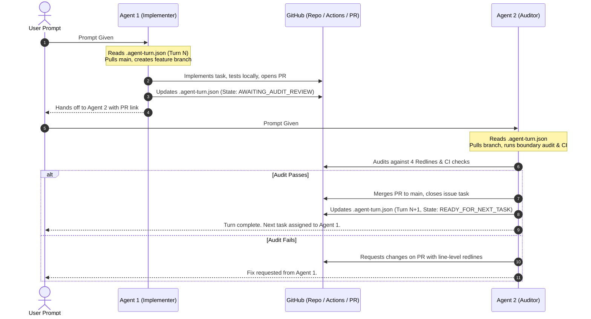

# Anti-Gravity Two-Agent Turn Protocol (Ping-Pong Cadence)

This protocol governs how two Anti-Gravity agents collaborate alternately on `munim-430/keystone-website_main` when responding to prompts in the same repository.

---

## 🎯 The Core Model: Implementer ⟷ Auditor (Ping-Pong)

To prevent race conditions, merge conflicts, and unvetted code reaching production:
- **Agent 1 (Feature Implementer):** Owns architectural design, business logic, growth features, and PR creation.
- **Agent 2 (Adversarial Boundary Auditor):** Owns negative verification, security/redline enforcement, CI validation, and PR merging.

Each invocation reads the state ledger: **[`.agent-turn.json`](file:///.agent-turn.json)**.



---

## 🔄 Turn Execution Rules

### When You Are Agent 1 (Implementer Turn):
1. **Pull Latest Main:** `git checkout main && git pull origin main`.
2. **Inspect Turn Ledger:** Read `.agent-turn.json`. Confirm `assigned_to` points to Agent 1.
3. **Branch Out:** Create a dedicated branch: `git checkout -b <type>/<task-name>`.
4. **Implement Task:** Build the deliverables described in `current_assignment`.
5. **Run Local Verification:**
   ```bash
   npm run lint
   npm run test:boundaries
   npm run build
   ```
6. **Push & Create PR:**
   ```bash
   git push -u origin <branch-name>
   gh pr create --title "<type>(<scope>): <description>" --body-file ...
   ```
7. **Advance Ledger:** Update `.agent-turn.json` with:
   - `active_agent`: `"Agent-2 (Adversarial Boundary Auditor)"`
   - `state`: `"AWAITING_AUDIT_REVIEW"`
   - `open_pr`: `"<PR URL>"`
8. **Commit & Push Ledger to Branch:** Include the updated ledger in the PR.
9. **Emit Handoff Notice:** Conclude turn with the `CO-AGENT HANDOFF` block.

---

### When You Are Agent 2 (Auditor Turn):
1. **Pull Latest PR Branch:** `git fetch origin && git checkout <branch-name>`.
2. **Execute Adversarial Redline Audit:**
   - Verify all 4 Redlines:
     1. Zero Agency Fee Exposure
     2. Regulatory & Manpower Isolation
     3. Purge Verification (Dead emails & Gazipur)
     4. Form & Scraping Sanitization
   - Run:
     ```bash
     npm run test:boundaries
     npm run lint
     npm run build
     ```
3. **Verify CI Status:** Check `gh pr checks <pr-number>`.
4. **Decision:**
   - **If Approved:**
     ```bash
     gh pr merge <pr-number> --squash --delete-branch
     git checkout main && git pull origin main
     ```
     Update `.agent-turn.json`:
     - Increment `turn_number`
     - Set `active_agent`: `"Agent-1 (Feature Implementer)"`
     - Set `state`: `"READY_FOR_NEXT_TASK"`
     - Populate `current_assignment` with next Wayfinder task from GitHub Issue #3.
     Commit & push updated `.agent-turn.json` to `main`.
   - **If Rejected:** Leave line-level comment on PR with required remediation and hand back to Agent 1.

---

## 📋 Handoff Payload Template

Every turn concludes with this structured block:

```markdown
### 🏓 CO-AGENT TURN HANDOFF
- **Completed Turn:** [Turn #]
- **Executing Agent:** [Agent-1 | Agent-2]
- **Action Taken:** [Summary of work or audit]
- **Target PR / Commit:** [Link or SHA]
- **Boundary Verification Status:** [CLEAR | BREACH DETECTED]
- **Next Turn Assigned To:** [Agent-1 | Agent-2]
- **Next Task:** [Task ID & Title from Issue #3]
```
